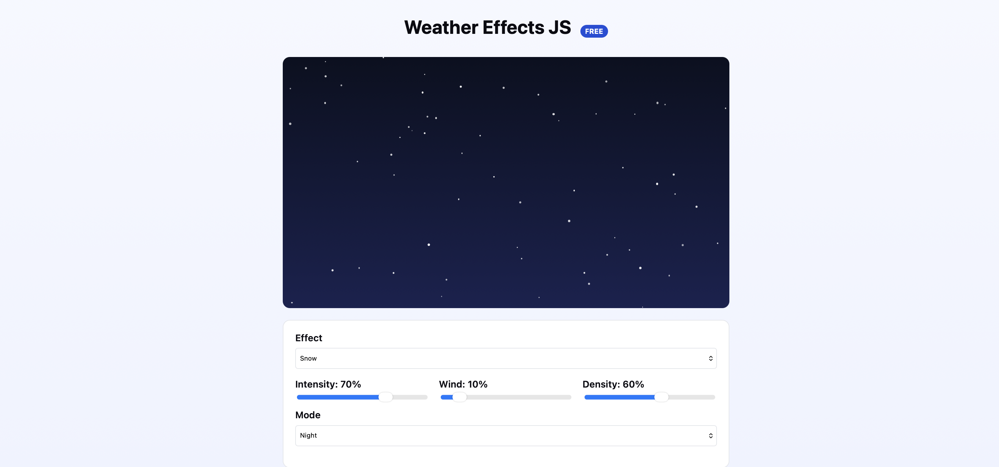

# Weather Effects JS

Lightweight DOM-based weather effects library.

## Install

```bash
npm install weather-effects-js
```

## Quick Start

```html
<div id="weather-container"></div>

<script type="module">
  import { createWeatherEffect } from 'weather-effects-js';

  const container = document.getElementById('weather-container');
  const unmount = createWeatherEffect('rain', {
    container,
    intensity: 70,
    density: 60,
    mode: 'day'
  });

  // Cleanup when done
  // unmount();
</script>
```

## Effects

- **Rain** - Animated raindrops with customizable intensity and density
- **Snow** - Falling snow particles with wind effects
- **Fog** - Atmospheric fog effect
- **Sun** - Glowing sun with adjustable intensity
- **Lightning** - Thunderstorm lightning effects
- **Cloudy** - Animated cloud formations

## API

### createWeatherEffect(type, options)

Creates and mounts a weather effect.

```typescript
import { createWeatherEffect, EffectType, EffectOptions } from 'weather-effects-js';

const unmount = createWeatherEffect(type: EffectType, options: EffectOptions);
```

### EffectOptions

```typescript
interface EffectOptions {
  container: HTMLElement;    // Required: DOM element to render effect
  intensity?: number;       // 0-100: Effect strength (default: 60)
  windSpeed?: number;       // 0-100: Wind influence (default: 10)
  density?: number;         // 0-100: Particle count (default: 40)
  mode?: 'day' | 'night';   // Visual theme (default: 'day')
}
```

### Individual Effect Functions

```typescript
import { mountRain, mountSnow, mountFog, mountSun, mountLightning, mountCloudy } from 'weather-effects-js';

// Each returns an unmount function
const unmount = mountRain({
  container: element,
  intensity: 70,
  density: 60
});
```

## Demo

**Live Demo:** [https://c3nk.com/examples/weather-effects-js/](https://c3nk.com/examples/weather-effects-js/)

Run the demo locally:

```bash
npm install
npm run dev
```

Open http://localhost:5173 to see the interactive demo.

### Screenshot


## Features

- ✅ Pure DOM rendering (no Canvas/WebGL)
- ✅ TypeScript support
- ✅ Zero dependencies
- ✅ Lightweight (~5KB minified)
- ✅ Customizable parameters
- ✅ Day/Night themes

## Browser Support

- Chrome 80+
- Firefox 75+
- Safari 14+
- Edge 88+

## License

MIT